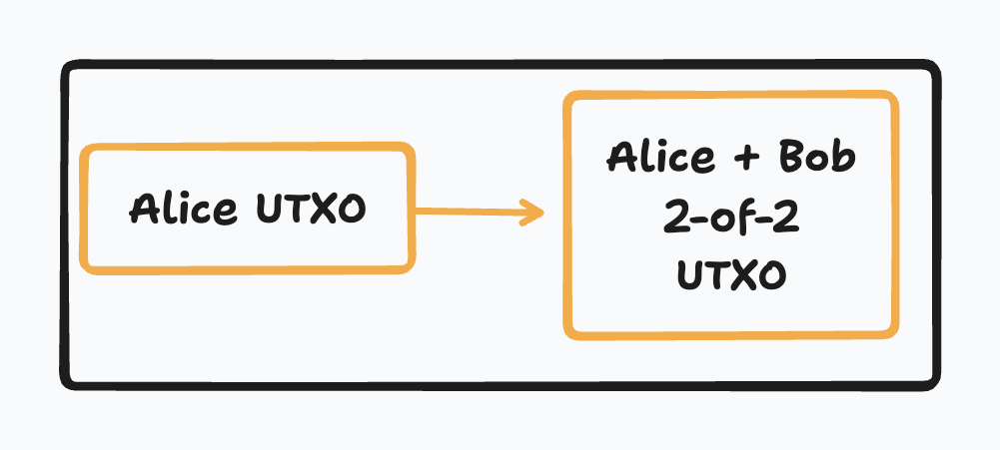
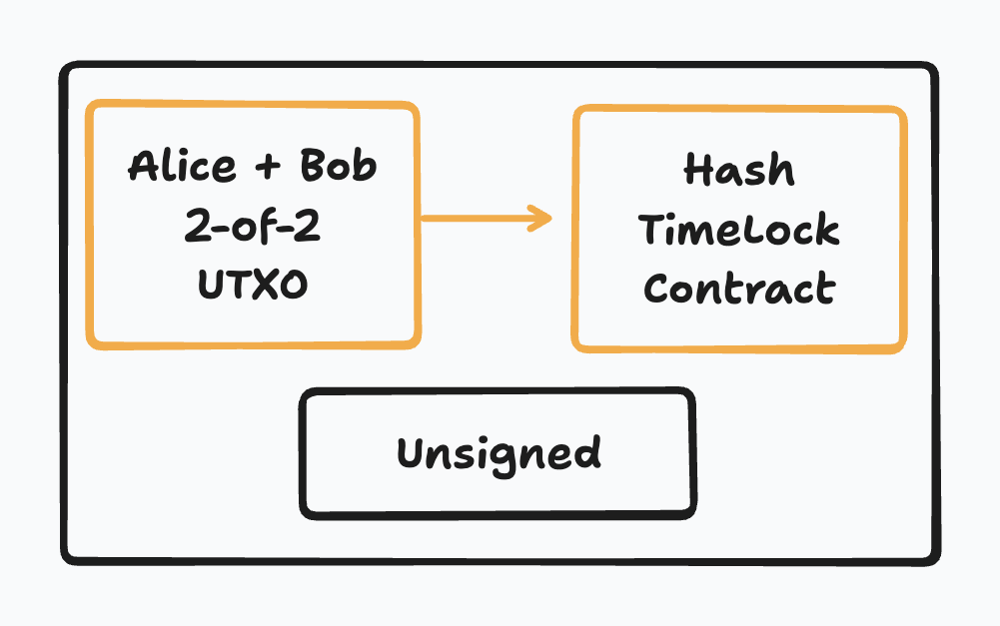

# Architecture

The architecture involves two types of participants: makers and takers. Makers provide liquidity and compete to offer the best rates, while takers initiate swaps and pay fees. The protocol operates through a series of funding and contract transactions, ensuring atomic execution and eliminating the risks of partial trades or asset loss.

## Taker

The taker is the party that initiates the swap. They fetch the offers made by makers, select the most suitable one, and proceed with the swap process. The taker pays the fees associated with the swap and ensures the completion of the transaction.

The taker also serves as the intermediary between the makers, facilitating the exchange of information and ensuring the smooth execution of the swap.

```text
Maker1 <----> Taker <----> Maker2
```

## Maker

The maker is the party that provides liquidity and competes in the market to offer the best rates. Makers run servers that facilitate swaps and maintain market liquidity through a competitive fee structure. They respond to taker requests, lock funds in multisig outputs, and execute the swap process.

## Directory Server

The directory server acts as a lookup service that helps takers discover available makers and their offers. It provides information about the makers' liquidity, fees, and reputation, enabling takers to make informed decisions when selecting a maker for the swap.

## Transactions

The foundation of Coinswap rests on two primary transaction types that work in concert:

### Funding Transactions

These transactions lock coins in 2-of-2 multisig outputs, ensuring that the funds are secure and available for the swap process. Funding transactions are the initial step in the swap process and establish the foundation for the subsequent contract transactions.



The redeem scripts for the funding transactions are constructed as follows:

```shell
OP_PUSHNUM_2 <PubKey1> <PubKey2> OP_PUSHNUM_2 OP_CHECKMULTISIG
```

### Contract Transactions

These transactions establish time-locked redemption conditions and serve as the mechanism for completing the swap. Contract transactions include hash preimages that act as cryptographic proofs, ensuring atomic execution of the swap process. The completion of the swap involves the exchange of private keys, finalizing the transaction.



The redeem scripts for the contract transactions are constructed as follows:

```shell
/*
    opcodes                  | stack after execution
                             |
                             | <sig> <preimage>
    OP_SIZE                  | <sig> <preimage> <size>
    OP_SWAP                  | <sig> <size> <preimage>
    OP_HASH160               | <sig> <size> <hash>
    H(X)                     | <sig> <size> <hash> H(X)
    OP_EQUAL                 | <sig> <size> 1|0
    OP_IF                    |
        pub_hashlock         | <sig> <size> <pub>
        32                   | <sig> <size> <pub> 32
        1                    | <sig> <size> <pub> 32 1
    OP_ELSE                  |
        pub_timelock         | <sig> <size> <pub>
        0                    | <sig> <size> <pub> 0
        locktime             | <sig> <size> <pub> 0 <locktime>
    OP_ENDIF                 |
    OP_CHECKSEQUENCEVERIFY   | <sig> <size> <pub> (32|0) (1|<locktime>)
    OP_DROP                  | <sig> <size> <pub> (32|0)
    OP_ROT                   | <sig> <pub> (32|0) <size>
    OP_EQUALVERIFY           | <sig> <pub>
    OP_CHECKSIG              | true|false
    */

    //spent with witnesses:
    //hashlock case:
    //<hashlock_signature> <preimage len 32>
    //timelock case:
    //<timelock_signature> <empty_vector>
```