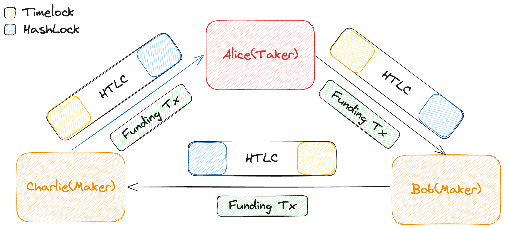

# Architecture

The architecture involves two types of participants: makers and takers.
Makers provide liquidity for the swap and compete to offer the best facilitation fee rates, while takers initiate swaps and pay fees.
The protocol operates through a series of transactions. These transactions are of two types: funding transactions and contract transactions.

## Taker

The taker is the party that initiates the swap.
They fetch the offers made by different makers, select the most suitable one, and proceed with the swap process. The taker pays the fees associated with the swap and ensures the completion of the transaction.

The taker also serves as the intermediary between the makers, facilitating the exchange of messages and ensuring the smooth execution of the swap. This will be more clear in the [protocol flow](./3_protocol-flow.md) section.

```text
Maker1 <----> Taker <----> Maker2
```

## Maker

The maker is the party that provides liquidity and competes in the market to offer the best rates.
Makers run servers that facilitate swaps and maintain market liquidity through a competitive fee structure.
They respond to taker requests, lock funds in multisig outputs, and execute the swap process.

## Directory Server

The directory server acts as a lookup service that helps takers discover available makers and their offers.
It provides information about the makers' liquidity, fees, and reputation, enabling takers to make informed decisions when selecting a maker for the swap.

## Transactions

The foundation of Coinswap rests on two primary transaction types that work in concert:

### Funding Transactions

These transactions lock coins in 2-of-2 multisig outputs, ensuring that the funds are secure and available for the swap process.
Funding transactions are the initial step in the swap process and establish the foundation for the subsequent contract transactions.


The redeem scripts for the funding transactions are constructed as follows:

```shell
OP_PUSHNUM_2 <PubKey1> <PubKey2> OP_PUSHNUM_2 OP_CHECKMULTISIG
```

### Contract Transactions

The contract transaction is a hash-timelocked contract (HTLC) that can be redeemed by the receiver with the preimage of the hashlock or by the sender after the timelock expires.
This transaction uses the CheckSequenceVerify (`OP_CSV`) opcode to enforce the timelock and the `OP_HASH160` opcode to enforce the hashlock.


The redeem scripts for the contract transactions are constructed as follows:

```shell
/*
    opcodes                  | stack after execution
                             |
                             | <sig> <preimage>
    OP_SIZE                  | <sig> <preimage> <size>
    OP_SWAP                  | <sig> <size> <preimage>
    OP_HASH160               | <sig> <size> <hash>
    H(X)                     | <sig> <size> <hash> H(X)
    OP_EQUAL                 | <sig> <size> 1|0
    OP_IF                    |
        pub_hashlock         | <sig> <size> <pub>
        32                   | <sig> <size> <pub> 32
        1                    | <sig> <size> <pub> 32 1
    OP_ELSE                  |
        pub_timelock         | <sig> <size> <pub>
        0                    | <sig> <size> <pub> 0
        locktime             | <sig> <size> <pub> 0 <locktime>
    OP_ENDIF                 |
    OP_CHECKSEQUENCEVERIFY   | <sig> <size> <pub> (32|0) (1|<locktime>)
    OP_DROP                  | <sig> <size> <pub> (32|0)
    OP_ROT                   | <sig> <pub> (32|0) <size>
    OP_EQUALVERIFY           | <sig> <pub>
    OP_CHECKSIG              | true|false
    */

    //spent with witnesses:
    //hashlock case:
    //<hashlock_signature> <preimage len 32>
    //timelock case:
    //<timelock_signature> <empty_vector>
```

## Swap Architecture

Every party in a swap acts both as a sender and a receiver.
As a sender, they lock funds in a 2-of-2 multisig output(Funding Transaction).
Before broadcasting this transaction, they create a contract transaction which spends the funds from this multisig output.
This contract transaction is a hash-timelocked contract (HTLC) that can be redeemed by the receiver with the preimage of the hashlock or by the sender after the timelock expires.



### Hashlock

The hashpreimage is a cryptographic proof that allows the receiver to redeem the contract transaction. The taker generates the hashpreimage.
All the contract transactions in the swap require this hashpreimage to be redeemed via the hashlock.

### Staggered Timelocks

Like the Lightning Network, Coinswap uses staggered timelocks to ensure the atomic execution of the swap process.
The timelocks are set at different intervals. The staggered timelocks prevent the risk of partial trades or asset loss. Every subsequent maker in the swap has a shorter timelock than the previous maker.

### Swap Completion

After all the funding transactions are broadcasted, the taker reveals the hashpreimage to the makers. This is enough for every party to be able to claim their funds from the contract transactions.
The next step is for the senders to hand over the private keys of the multisig outputs to the receivers.
This allows the receivers to spend funds directly from the multisig outputs.
This marks the completion of the swap process.
