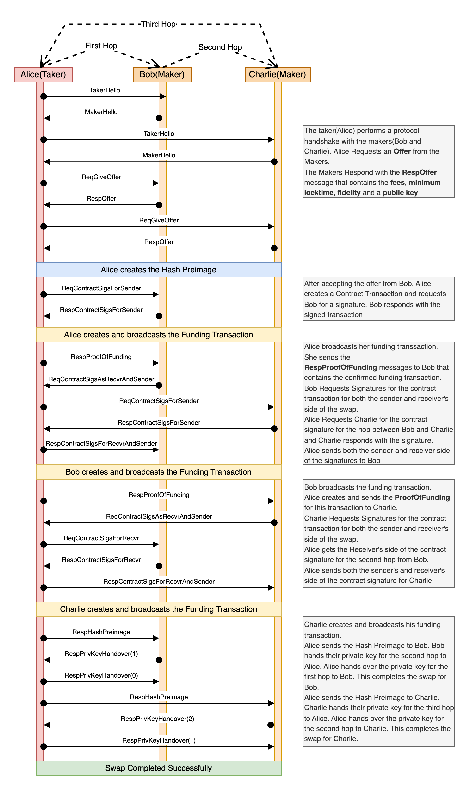

# Protocol Flow

This section outlines the step-by-step process of a Coinswap transaction, detailing the actions taken by the taker, maker, and directory server. Each stage involves a series of interactions between the participants, culminating in the successful completion of the swap.

We will showcase the protocol flow in a scenario where we have one taker(Alice) and two makers(Bob and Charlie).

  

